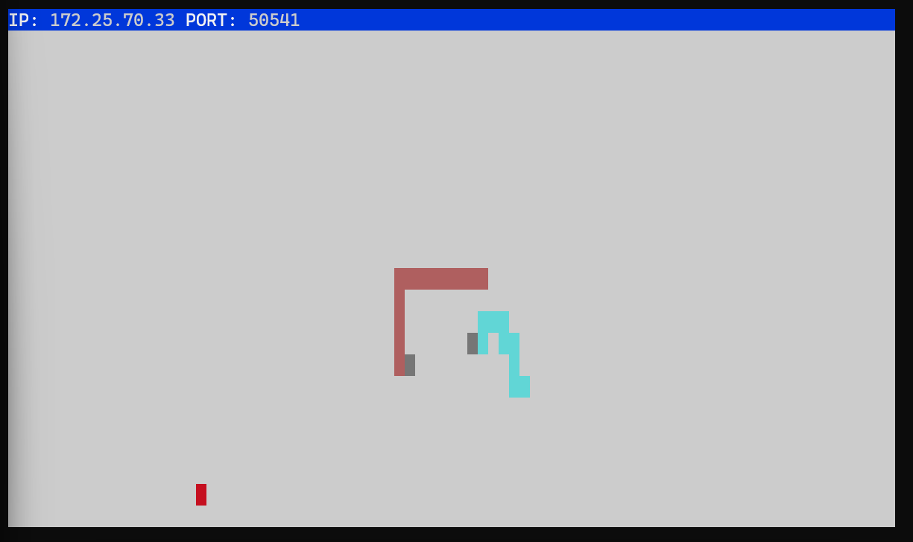
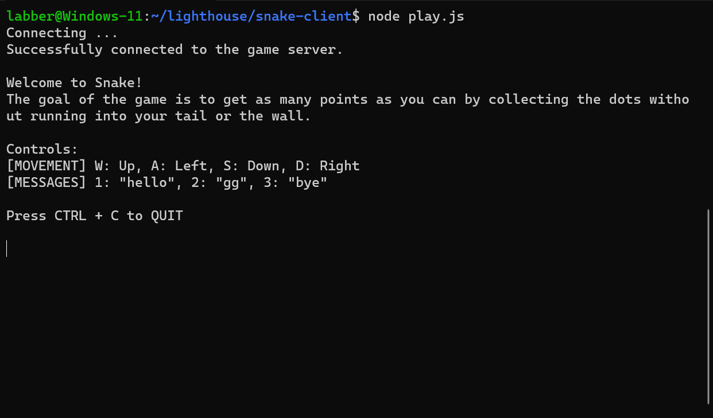

# 🐍Snake Client Project 

Snake is a game that originated as a two player arcade game released in 1976 called Blockade. The original gameplay was simply to survive longer than the other player by avoiding walls and tails, but we've since expanded it to include trying to "eat" as many dots as possible. The more you eat, the longer your tail grows, and the harder the game becomes.

This is a multiplayer take on the game that connects players via a server.

Be sure that you run the server BEFORE running the client, or it won't work! Said server can be downloaded [here](https://github.com/lighthouse-labs/snek-multiplayer).

This project was made for LHL's Web Flex program.

## Final Product

Gameplay:

Console:

## Getting Started

- Follow steps inside the snek server repo to run the server side.
- Run the development snake client using the `node play.js` command.
- Player name and server settings are in the constants.js file.
  - Note: Keybinds can not be changed.